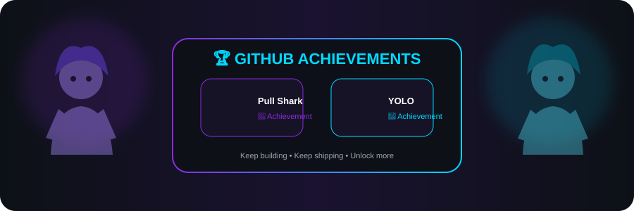
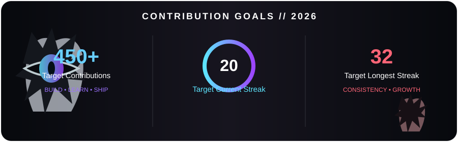

<!-- ===================== ANIME DEVOPS PROFILE ===================== -->

 

---

## 🌸 About Me | 自己紹介

> **「コードを書く。自動化する。そして、壊れたら直す。」**  
> *Write code. Automate everything. Fix it when it breaks.* ⚡

- 👋 Hey, I'm **Krishna Rawat**
- ☁️ DevOps & Cloud Engineer focused on **Microsoft Azure**
- 🏗️ Building cloud infrastructure with **Terraform / IaC**
- 🔄 Automating **CI/CD pipelines** with Azure DevOps & GitHub Actions
- ☸️ Working with **Kubernetes / AKS & Docker**
- 🐧 Linux administration, troubleshooting & scripting
- 🛡️ Exploring **DevSecOps, monitoring and cloud security**
- 🎯 My current mission: **turn manual infrastructure into automated infrastructure**

---

## ⚔️ My DevOps Arsenal | 技術スタック

### ☁️ Cloud & IaC

### 🔥 CI/CD & Containers

### 🐧 Linux & Scripting

### 📊 Monitoring & Git

---

## 🌌 Featured Missions | 主なプロジェクト

| 🌀 Mission | ⚡ Power |
|---|---|
| ☁️ **[Azure DevSecOps CI/CD → AKS](https://github.com/kriish2002/azure-devsecops-cicd-aks)** | Azure • CI/CD • Kubernetes • DevSecOps |
| 🏗️ **[Enterprise Terraform Pipeline](https://github.com/kriish2002/enterprise-terraform-pipeline)** | Terraform • IaC • Automation |
| ☸️ **[K8s Infrastructure](https://github.com/kriish2002/K8s-infra)** | Kubernetes • Infrastructure |
| 🔧 **[Infrastructure using Terraform](https://github.com/kriish2002/Infrastructure_using_Terraform)** | Azure • Terraform |
| 🤖 **[AI Job Agent](https://github.com/kriish2002/AI-Job-Agent)** | Python • Automation • Job Matching |
| 📚 **[DevOps Interview Guide](https://github.com/kriish2002/DevOps-Interview-Guide)** | DevOps • Cloud • Learning |

---

## ⚡ GitHub Power Level

  

---

## 🏆 GitHub Achievements | 実績

 

🦈 Pull Shark • 🚀 YOLO • More achievements can be unlocked through qualifying GitHub activity.

---

## 📈 Contribution Activity

### 🚀 Consistency • Learning • Building

> **Every contribution represents another step toward better automation, cleaner infrastructure, and stronger cloud engineering skills.**

 

**☁️ Cloud Infrastructure**　•　**🔄 CI/CD Automation**　•　**☸️ Kubernetes**　•　**🏗️ Infrastructure as Code**

---

## 🎯 Contribution Goals

---

## 🎯 Current Training Arc

**☁️ Azure**　→　**🏗️ Terraform**　→　**☸️ AKS**　→　**🔄 CI/CD**　→　**🛡️ DevSecOps**　→　**🚀 Production**

---

## 🌐 Connect With Me | つながろう

### 💻 Code & Professional Network

&nbsp;

  

### ✨ Socials

&nbsp;

  

☁️ Azure • 🔄 DevOps • ☸️ Kubernetes • 🏗️ Terraform

 

> 🌸 **Small commits. Big deployments. Never stop learning.** 🌸

<!-- ⭐ If you like my work, feel free to explore my repositories! -->
